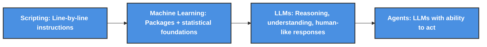

# Demo: How to configure the Microsoft Fabric (Power BI) MCP connector in Copilot Studio 

<b>List of References</b> (Click to expand)

- [Consume Fabric data agent from Azure AI Foundry Services (preview)](https://learn.microsoft.com/en-us/fabric/data-science/data-agent-foundry) - AI Foundry approach (full code)
- [Microsoft Fabric end-to-end security scenario](https://learn.microsoft.com/en-us/fabric/security/security-scenario)
- [Fabric data agent example with the AdventureWorks dataset (preview)](https://learn.microsoft.com/en-us/fabric/data-science/data-agent-end-to-end-tutorial)
- [What is Azure AI Foundry?](https://learn.microsoft.com/en-us/azure/ai-foundry/what-is-azure-ai-foundry#which-type-of-project-do-i-need)
- [Best Practice Guidance for PTU](https://techcommunity.microsoft.com/blog/azure-ai-foundry-blog/best-practice-guidance-for-ptu/4152133) - blog
- [Connect your agent to an existing Model Context Protocol (MCP) server](https://learn.microsoft.com/en-us/microsoft-copilot-studio/mcp-add-existing-server-to-agent)
- [Copilot Studio MCP Catalog](https://learn.microsoft.com/en-us/microsoft-copilot-studio/mcp-microsoft-mcp-servers)
- [Connect to an existing Model Context Protocol (MCP) server](https://learn.microsoft.com/en-us/microsoft-copilot-studio/mcp-add-existing-server-to-agent)
- [Microsoft Copilot Studio - MCP](https://github.com/microsoft/mcsmcp) - GitHub repo
- [Consume a Fabric Data Agent in Microsoft Copilot Studio (preview)](https://learn.microsoft.com/en-us/fabric/data-science/data-agent-microsoft-copilot-studio) - Agent
- [Connect to an existing Model Context Protocol (MCP) server](https://learn.microsoft.com/en-us/microsoft-copilot-studio/mcp-add-existing-server-to-agent) - MCP
- [Connecting an Agent in Copilot Studio to an MCP Server](https://techcommunity.microsoft.com/blog/microsoft365copilotblog/connecting-an-agent-in-copilot-studio-to-an-mcp-server/4448362) - blog 
- [Connect AI Agents to Fabric API for GraphQL with a local Model Context Protocol (MCP) server](https://learn.microsoft.com/en-us/fabric/data-engineering/api-graphql-local-model-context-protocol)
- [Fabric data agent concepts (preview)](https://learn.microsoft.com/en-us/fabric/data-science/concept-data-agent)
- [How to create a Fabric data agent (preview)](https://learn.microsoft.com/en-us/fabric/data-science/how-to-create-data-agent)
- [Fabric data agent example with the AdventureWorks dataset (preview)](https://learn.microsoft.com/en-us/fabric/data-science/data-agent-scenario): `This example sets up a Fabric data agent to enable conversational AI over enterprise data`. It connects to a lakehouse with the AdventureWorks dataset and allows users to ask natural language questions. The agent interprets queries, accesses data from sources like warehouses, semantic models, and KQL databases, and returns insights. It simplifies data interaction without requiring code or SQL.

<b>Table of Content</b> (Click to expand)

- [Prepare your data](#prepare-your-data)
- [Use Fabric Data Agent Preferred for Semantic Models](#use-fabric-data-agent-preferred-for-semantic-models)
- [Fabric Data linked to Copilot Studio MCP](#fabric-data-linked-to-copilot-studio-mcp)

> `How we move from basic coding all the way to AI agents?`

<b> More details about it here </b> (Click to expand)

  
> - We all `start with scripting`, no matter the language, it’s the first step. `Simple/complex instructions, written line by line`, to get something done
> - Then comes `machine learning`. At this stage, we’re not reinventing the math, we’re `leveraging powerful packages built on deep statistical and mathematical foundations.` These tools let us `automate smarter processes, like reviewing claims with predictive analytics. You’re not just coding anymore; you’re building systems that learn and adapt.`
> - `LLMs`. This is what most people mean when they say `AI.` Think of `yourself as the architect, and the LLM as your strategic engine. You can plug into it via an API, a key, or through integrated services. It’s not just about automation, it’s about reasoning, understanding, and generating human-like responses.`
> - And finally, `agents`. These are LLMs with the `ability to act`. They don’t just respond, `they take initiative. They can create code, trigger workflows, make decisions, interact with tools, with other agents. It’s where intelligence meets execution`

 

<b> Before Fabric</b> (Click to expand)

  
  

> E.g of a solution prior Microsoft Fabric:

  

> Now from one place:

  

  

From [Microsoft Documentation](https://learn.microsoft.com/pt-br/fabric/fundamentals/microsoft-fabric-overview)

> Low code approach (Copilot Studio Agents):

> Full code approach (AI Foundry Agents):

> [!NOTE]
> About the licensing: [Microsoft 365 Copilot Pricing – AI Agents | Copilot Studio](https://www.microsoft.com/en-us/microsoft-365-copilot/pricing/copilot-studio?msockid)  
> Copilot Credit consumption rates:
> - Regular (non-generative AI) = 1 Copilot Credit; and
> - Generative AI (answers over your data) = 2 Copilot Credits.
> Customers can use a mix of classic and generative AI messages with the capacity. [Learn more](https://cdn-dynmedia-1.microsoft.com/is/content/microsoftcorp//microsoft/bade/documents/products-and-services/en-us/bizapps/Power-Platform-Licensing-Guide-September-2025.pdf)
> - Copilot Credits are offered via prepaid Copilot Credit pack subscription licenses. One Copilot Credit pack = 25,000 Copilot Credits.
> - The Copilot Studio pay-as-you-go meter allows you to post-pay based on the actual number of Copilot Credits consumed in a month.

## Prepare your data

> [Medallion Architecture](./0_Medallion_Arch/): Explore the structured approach to data management.

 

   
 

> Or if you need to handle `complex data transformations and large-scale data processing`, you can use our combined solution of **Fabric + Databricks**. This powerful combination leverages the strengths of both platforms to provide a robust data processing pipeline. This workshop on [Fabric with Databricks for Data Analytics](https://microsoft.github.io/TechExcel-Fabric-with-Databricks-for-Data-Analytics/) offers a comprehensive step-by-step guide on developing Medallion Architecture using Fabric and Databricks.  

  

Click [here to read more about Azure Databricks + Fabric](https://github.com/MicrosoftCloudEssentials-LearningHub/DemosScenarios-TechTalks/blob/main/0_Azure/2_AzureAnalytics/3_Databricks/1_demos/0_MedallionArch_Fabric%2BDatabricks/README.md) `better together`

## Use Fabric Data Agent (Preferred for Semantic Models)

> Data Agent (AI skills in your data) in Microsoft Fabric enable users to `create conversational AI experiences that answer questions about data stored
> in lakehouses, warehouses, Power BI semantic models, and KQL databases`. These skills make data insights accessible and
> actionable, allowing users to `interact with data naturally and receive relevant answers without needing technical expertise`.
> You can create custom Q&A systems using generative AI, guiding the AI with instructions and examples to ensure it understands your organization's context and data.

Key Features:

- Customizable Q&A Systems: Tailor the AI to answer specific questions relevant to your organization.
- Generative AI: Leverage advanced AI to interact with your data, enhancing data-driven decision-making.
- Ease of Use: Once set up, users can simply ask questions and get accurate answers without needing deep technical knowledge.

E.g: 

<b> Setup required</b> (Click to expand)

1. Please ensure you read all the [prerequisites](https://learn.microsoft.com/en-us/fabric/data-science/how-to-create-data-agent#prerequisites)
2. **Tenant switch enabled**: These features must be activated as mentioned here [prerequisites](https://learn.microsoft.com/en-us/fabric/data-science/how-to-create-data-agent#prerequisites)
 
    <https://github.com/user-attachments/assets/f0df6fb9-e139-4c97-9b68-a6ea05eb6584>

3. **F2 Fabric capacity or higher**: Ensure you have the appropriate Fabric capacity.
4. **Workspace configured with Fabric Capacity**:

    

    

5. At least one of these: A warehouse, a lakehouse, one or more Power BI semantic models, or a KQL database with data.
      

<b> How it works (Click to expand)

1. Go to the `workspace`, click on `+ New item`, search for `Data agent`, and select it.

    

2. Choose the name for the Data agent instance:
   
     <https://github.com/user-attachments/assets/752734e4-f7f6-44a3-8ccb-069ac005a410>

3. Add data:
   
     <https://github.com/user-attachments/assets/9800e74e-cbca-45ff-a712-bb2e8a095bb5>

4. Relate tables, and start asking!

     

> [!NOTE]
> Or use: MCP Server (For Custom Integrations) you create it and connect via Power Platform for example.

<b> Examples of what to ask (Click to expand)

| **Question**                                                                 | **Example of it looks**                                                                                       |
|------------------------------------------------------------------------------|---------------------------------------------------------------------------------------------------------------|
| **Data Exploration**                                                         |                                                                                                               |
| - Can you provide an overview of this dataset?    - Are there any missing values or anomalies in this dataset?                               |            |
|  What are the key variables in this data?                                   |       |
| **Data Insights**                                                            |                                                                                                               |
| What patterns or trends can you identify in this data?                     |               |
| Can you highlight any correlations between variables?                      |               |
| What are the outliers in this dataset?                                     |                  |

## Fabric Data linked to Copilot Studio (MCP)

1. Create a Data Agent in Microsoft Fabric and connect it to your semantic model.
2. Publish the agent and verify that it is running successfully.
3. In Copilot Studio, go to `Agents → Add an agent`, then `select your Fabric Data Agent from the list.`
4. Test the integration by running sample queries such as: `What was the revenue last quarter?`

https://github.com/user-attachments/assets/bdb581c2-ccc9-48b1-a4ce-6b3c465f10bc

